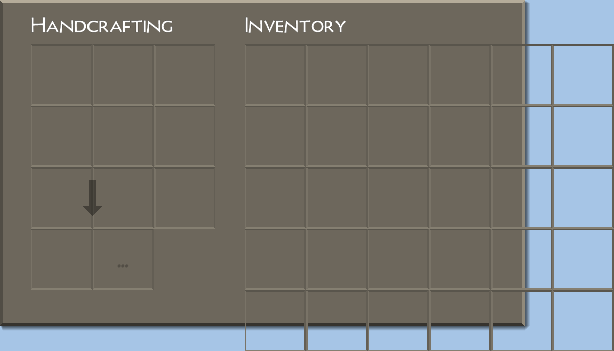
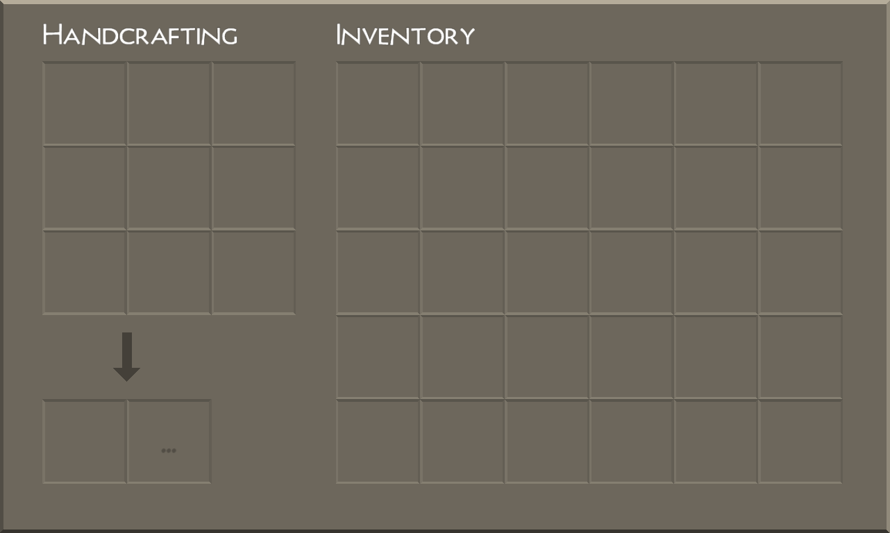

title: 扩展背包Mod
#扩展背包Mod

>本教程由百度贴吧-[销锋镝铸](http://tieba.baidu.com/home/main/?un=销锋镝铸){: target="\_blank" }编写

本例子将把生存模式背包大小提高至6×5，同时将背包中的合成台修改为3×3  
要做到以上效果，只需要修改`Content.pak`中的文件：

##修改FullInventoryWidget.xml
`FullInventoryWidget.xml`位于`Content.pak\Widgets`目录，它是生存模式时的背包`WIdget(部件)`，以下简称为`主背包`。它的代码如下：
```xml linenums="1"
<FullInventoryWidget xmlns="runtime-namespace:Game">
<!--主背包部件（根元素）-->
  <BevelledRectangleWidget Size="614, 382" BevelSize="3" />
  <!--斜边矩形部件(在这里被当作背景使用) 大小:614(宽)×382(高) 材质:{Textures/Gui/Panel}(文件路径) 斜边宽度:3-->
  <GridPanelWidget Name="InventoryGrid" CanvasWidget.Position="286, 52" ColumnsCount="4" RowsCount="4"/>
  <!--网格部件 名字:物品栏 位置:286(x横，正方向右), 52(y纵，正方向下) 网格纵列数:4 网格横行数:4-->
  <GridPanelWidget Name="CraftingGrid" CanvasWidget.Position="36, 52" ColumnsCount="2" RowsCount="2"/>
  <!--网格部件 名字：合成栏 ……-->
  <InventorySlotWidget Name="CraftingResultSlot" CanvasWidget.Position="36, 268" />
  <!--物品格部件 名字：第一个合成结果格 ……-->
  <InventorySlotWidget Name="CraftingRemainsSlot" CanvasWidget.Position="108, 268" >
  <!--物品格部件 名字：第二个合成结果格 ……-->
    <LabelWidget Text="..." Font="{Fonts/Pericles24}" Color="0, 0, 0, 64" HorizontalAlignment="Center" VerticalAlignment="Center"/>
    <!--标签部件(看起来就是一个文本部件) 文本: ... 字体:{Fonts/Pericles24}(文件路径) 颜色：0,0,0,64(RGBA，红绿蓝透明度，0~255) 垂直对齐:居中-->
  </InventorySlotWidget>
  <LabelWidget CanvasWidget.Position="36, 14" Text="Handcrafting" Font="{Fonts/Pericles24}" Color="255, 255, 255, 192"/>
  <!--略……-->
  <LabelWidget CanvasWidget.Position="286, 14" Text="Inventory" Font="{Fonts/Pericles24}" Color="255, 255, 255, 192"/>
  <!--略……-->
  <ArrowLineWidget Color="0, 0, 0, 96" Width="8" ArrowWidth="24" PointsString="108, 211; 108, 241" AbsoluteCoordinates="true"/>
  <!--箭头部件 …… 箭尾宽度:8 箭头宽度:24 起始点坐标:108(开始点x), 211(开始点y), 108(结束点x), 241(结束点y) 是否绝对坐标：是-->
</FullInventoryWidget>
```
以上行号对应在图中位置
{: style="max-width: 540px; display:block; margin:1em auto;" }  
首先我们把`CraftingGrid(合成栏)`与`InventoryGrid(物品栏)`的`ColumnsCount(网格纵列数)`和`RowsCount(网格横行数)`改成需要的数值，即3、3和5、6，查看效果如下：
{: style="max-width: 540px; display:block; margin:1em auto;" }  
可以看到，两个栏都出现了超出范围或占用其他部件位置的情况，对此有两个解决方案，可任选其一或全部  
1. 调整其他部件的`Size(大小)`和`CanvasWidget.Position(位置)`  
2. 调整格子大小（修改`Survivalcraft.dll或exe\InventorySlotWidget\InventorySlotWidget()`，详细略）  
以下为仅采用第一个解决方案的修改好的代码和效果图，请对照原版查看：
```xml
<FullInventoryWidget xmlns="runtime-namespace:Game">
  <BevelledRectangleWidget Size="758, 454" Texture="{Textures/Gui/Panel}" BevelSize="3"/>
  <GridPanelWidget Name="InventoryGrid" CanvasWidget.Position="286, 52" ColumnsCount="6" RowsCount="5"/>
  <GridPanelWidget Name="CraftingGrid" CanvasWidget.Position="36, 52" ColumnsCount="3" RowsCount="3"/>
  <InventorySlotWidget Name="CraftingResultSlot" CanvasWidget.Position="36, 340" />
  <InventorySlotWidget Name="CraftingRemainsSlot" CanvasWidget.Position="108, 340" >
    <LabelWidget Text="..." Font="{Fonts/Pericles24}" Color="0, 0, 0, 64" HorizontalAlignment="Center" VerticalAlignment="Center"/>
  </InventorySlotWidget>
  <LabelWidget CanvasWidget.Position="36, 14" Text="Handcrafting" Font="{Fonts/Pericles24}" Color="255, 255, 255, 192"/>
  <LabelWidget CanvasWidget.Position="286, 14" Text="Inventory" Font="{Fonts/Pericles24}" Color="255, 255, 255, 192"/>
  <ArrowLineWidget Color="0, 0, 0, 96" Width="8" ArrowWidth="24" PointsString="108, 283; 108, 313" AbsoluteCoordinates="true"/>
</FullInventoryWidget>
```
{: style="max-width: 540px; display:block; margin:1em auto;" }  
至此FullInventoryWidget.xml已修改完成

##修改Database.xml
修改完`FullInventoryWidget.xml`后，可以发现主背包中的合成栏第4格之后和背包栏第16格之后的格子无法使用，原因是该文件只是主背包的布局文件，并不包含其中合成栏与背包栏的“实质”属性，此时合成栏与背包栏的“真实”格数还没有增加  
对此，我们需要修改`Database.xml`中主背包的合成栏与背包栏的“实质”属性。 在`Database.xml`中逐一排查和`Inventory`相关的代码，最后可以发现：
```xml
<ComponentTemplate Name="Inventory" Description="Player's inventory" Guid="de5c0cb9-42d1-4ee4-b58f-bb9bb668b890" InheritanceParent="81a44c6a-c30a-4f53-8d64-0c30aabab8f9">
	<Parameter Name="Class" Guid="b4723611-8b4e-4763-a11d-b4ff19c6109f" Value="Game.ComponentInventory" Type="string" />
	<Parameter Name="SlotsCount" Guid="c3a21e8b-d503-4c6d-af0f-67a67afaad96" Value="22" Type="int" />
	<!--参数 名字:格子数量 识别码:(略) 值:22 类型:整数-->
	<Parameter Name="ActiveSlotIndex" Description="Index of active slot" Guid="f4215298-f311-4bbc-932d-9f783e5a6e66" Value="0" Type="int" />
</ComponentTemplate>
```
以上代码中可以看到背包总格数是22，即底栏6格+背包栏4×4格；现在把它修改成`6+5×6=36`，回到游戏可以确认背包栏第16格之后的格子已经能够正常使用  
搜索该元素的`Guid(识别码)`，能够发现该元素被`/Database/DatabaseObjects/Entities/Creatures/Abstract/Player/Inventory`{: style="word-break:break-all;" }继承，它有一个同胞`CraftingTable`也具有`SlotsCount`参数，这个同胞的代码如下：
```xml
<MemberComponentTemplate Name="CraftingTable" Guid="0b234d05-36eb-4902-9571-6a884d707b85" InheritanceParent="48fdc8bb-8ca8-4d0f-af8d-25bfe9b56a19">
	<Parameter Name="SlotsCount" Guid="89328a33-979d-48a9-9b68-aac10a9404b2" Value="6" Type="int" />
</MemberComponentTemplate>
```
以上代码中可以看出主背包中合成栏的总格数是6，即原料2×2格+产物2格；现在把它修改成`3×3+2=11`，回到游戏可以确认合成栏第4格之后的格子已经能够正常使用

##修改Widgets文件夹其他文件
除了主背包外，还有大量的部件内含有背包，例如`CraftingTable(合成台)`、`Chest(箱子)`等，对此需要一一修改它们的布局文件  
以下是要修改的文件清单，修改方法类似上面的 [修改FullInventoryWidget.xml](#fullinventorywidgetxml)

* BowWidget.xml
* ChestWidget.xml
* ClothingWidget.xml
* CraftingTableWidget.xml
* CrossbowWidget.xml
* DispenserWidget.xml
* FullInventoryWidget.xml
* FurnaceWidget.xml
* FurnitureInventoryPanel.xml
* MusketWidget.xml

以上文件修改完毕后，扩展背包Mod就此完成