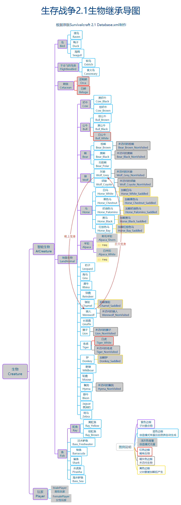

title: Database解析
#Database解析

!!! failure "未完成"
    页面未完成，[点击此处](https://lzm956902416.github.io/SMT/database_tutorial.html){: target="\_blank" }前往查看旧版

>本教程由百度贴吧-[销锋镝铸](http://tieba.baidu.com/home/main/?un=销锋镝铸){: target="\_blank" }编写

!!! warning ""
    请务必先阅读[XML教程][1]

##前言
在之前的[Content解析][2]中，提到：
>`Database.xml` 存储了所有动物（还有主角、船等实体）的大部分属性的xml文件，在“源代码”中新添加的`Subsystem`、`Component`子类也需要在此文件中注册

本教程将详细讲解该文件的文件结构和内容

##识别码和继承码
###识别码
该xml文件中大部分元素都有属性`Guid`，它的中文全名是`全局唯一标识符`，这里为了方便称呼称为 **识别码**；作用是使一个元素具有唯一性，能被被识别，因此 **不可重复**  
`Guid`的属性值常见格式为`xxxxxxxx-xxxx-xxxx-xxxx-xxxxxxxxxxxx`，其中每个都`x`是一个十六进制数；也可以不按照格式，任意填写，只要与其他元素的`Guid`属性值不重复都可以  

!!! note "十六进制数"
    十六进制数的基数是16，“逢十六进一”，采用的数码是0、1、2、3、4、5、6、7、8、9、A、B、C、D、E、F，其中A-F分别表示十进制数字10-15

如果在载入游戏时出现`An item with the same key has already been added.`{: style="font-variant: small-caps" }说明出现了重复的识别码，可以使用[GUID验证器][3]来查重。

###继承码
还有相当一部分元素拥有属性`InheritanceParent`，翻译成中文是`继承父辈`，我们一般称它为 **继承码**  
继承码的作用是使该元素继承一个识别码与它相同的元素的所有内容，包括属性、子元素和后代元素，可以在此称它们互为`父子对象`，称被继承的为`父对象`，继承父对象的为`子对象`  
如果父对象的属性名或子元素名在子元素中也有，那么这些属性和子元素不会继承给子对象

!!! warning ""
    `父子对象`非`父子元素`，父子对象在xml树结构上没有上下级关系

###举例说明
```xml
<Folder Name="A" Guid="1950"> <!--识别码为1950的文件夹(Folder)A(此例标识码和继承码不按照标准)-->
    <File Name="a" Author="Peter" /> <!--作者(Author)为Peter的文件(File)a-->
    <File Name="b" Author="Susan" /> <!--作者为Susan的文件b-->
</Folder>
<Folder Name="B" Guid="1956" InheritanceParent="1950">  <!--识别码为1956，继承码为1950的文件夹B-->
    <File Name="a" Author="Edmund" />  <!--作者为Edmund的文件a-->
    <File Name="c" Author="Lucy" />  <!--作者为Lucy的文件c-->
</Folder>
```
从这一段代码可以看出文件夹B将继承来自文件夹A的作者为Peter的文件a和作者为Susan的文件b，但是文件夹B自己已经有作者为Edmund的文件a，所以不会继承来自文件夹A的文件a，那么最终文件夹B的实际代码为
```xml
<Folder Name="B" InheritanceParent="1950">  <!--识别码为1950的文件夹B-->
    <File Name="a" Author="Edmund" />  <!--作者为Peter的文件a-->
    <File Name="b" Author="Susan" />  <!--作者为Edmund的文件b-->
    <File Name="c" Author="Lucy" />  <!--作者为Lucy的文件c-->
</Folder>
```

###默认继承
当一个元素没有继承码属性时，那么它将默认继承其父元素的父对象中相对应元素的内容，实例如下：
```xml
<EntityTemplate Name="AICreature" Guid="3f077159-f492-419b-859a-bb051de6339f" InheritanceParent="bc5be211-c1f8-4e50-9ffb-4fde625d2692">
    <MemberComponentTemplate Name="Mount" Guid="d7655ac3-4c88-4e89-8018-83155cd7bfbc" InheritanceParent="d0b14127-39ce-4490-af00-fb4111e9c51e">
        <Parameter Name="DismountOffset" Guid="3be6ca1c-17c5-4fd7-ad58-6f52d9651188" Value="1.5,0.3,0" Type="Vector3" />
    </MemberComponentTemplate>
    ...
</EntityTemplate>
...
<EntityTemplate Name="LandAnimal" Guid="e4275171-a39f-413f-8888-4c472868364d" InheritanceParent="3f077159-f492-419b-859a-bb051de6339f">
    <MemberComponentTemplate Name="Mount" Guid="d7855ac3-4c88-4e86-8018-83155cd7bfbc">
        <Parameter Name="MountOffset" Guid="3b86ca1c-1765-4fd7-ad58-6f52d9651188" Value="0,1.35,0" Type="Vector3" />
    </MemberComponentTemplate>
    ...
</EntityTemplate>
```
从实例中可以看到，`LandAnimal`的父对象是`AICreature`，那么`LandAnimal`的子元素`Mount`将继承得到`AICreature`的子元素`Mount`的子元素`DismountOffset`

##根元素Database
根元素`Database`及其子元素如下所示，以下将对每个子元素一一说明解析
```xml
<Database>
    <DatabaseObjectTypes>…</DatabaseObjectTypes>
    <Assemblies>…</Assemblies>
    <DatabaseObjects RootGuid="2c273f6a-efce-4bf1-a8ae-e3aea7ffb75c">…</DatabaseObjects>
    <GridViewPresets>…</GridViewPresets>
    <UserTypes />
</Database>
```

###DatabaseObjectTypes


{: title="点击查看大图" style="max-height: 600px;" onclick="openPhotoSwipe(0);" }  
点击图片查看大图，或[点击此处下载](http://pan.baidu.com/share/link?shareid=68742967&uk=2788149454){: target="\_blank" }
{: style="text-align: center;" }

<!-- photoswipe查看大图插件 -->
<link rel="stylesheet" href="../../assets/photoswipe/photoswipe.css">
<script src="../../assets/photoswipe/photoswipe.min.js"></script> 
<div class="pswp" tabindex="-1" role="dialog" aria-hidden="true">
    <div class="pswp__bg"></div>
    <div class="pswp__scroll-wrap">
        <div class="pswp__container">
            <div class="pswp__item"></div>
            <div class="pswp__item"></div>
            <div class="pswp__item"></div>
        </div>
        <div class="pswp__ui pswp__ui--hidden">
            <div class="pswp__top-bar">
                <div class="pswp__counter"></div>
                <button class="pswp__button pswp__button--close" title="Close (Esc)"></button>
                <button class="pswp__button pswp__button--share" title="Share"></button>
                <button class="pswp__button pswp__button--fs" title="Toggle fullscreen"></button>
                <button class="pswp__button pswp__button--zoom" title="Zoom in/out"></button>
                <div class="pswp__preloader">
                    <div class="pswp__preloader__icn">
                      <div class="pswp__preloader__cut">
                        <div class="pswp__preloader__donut"></div>
                      </div>
                    </div>
                </div>
            </div>
            <div class="pswp__share-modal pswp__share-modal--hidden pswp__single-tap">
                <div class="pswp__share-tooltip"></div> 
            </div>
            <button class="pswp__button pswp__button--arrow--left" title="Previous (arrow left)">
            </button>
            <button class="pswp__button pswp__button--arrow--right" title="Next (arrow right)">
            </button>
            <div class="pswp__caption">
                <div class="pswp__caption__center"></div>
            </div>
          </div>
        </div>
</div>
<script>
    function openPhotoSwipe(image_index) {
        var pswpElement = document.querySelectorAll('.pswp')[0];
        var items = [ {
            src: "../../saiming/database_1.png",
            w: 1105,
            h: 3064
        } ];
        var options = {
            index: image_index,
            bgOpacity: 0.7,
            showHideOpacity: true,
            shareButtons: [
                { id: 'download', label: '保存图片', url: '{{raw_image_url}}', download: true }
            ]
        };
        var gallery = new PhotoSwipe(pswpElement, PhotoSwipeUI_Default, items, options);
        gallery.init();
    };
</script>

[1]: xml_tutorial.md
[2]: content_tutorial.md#_2
[3]: resources.md#_16